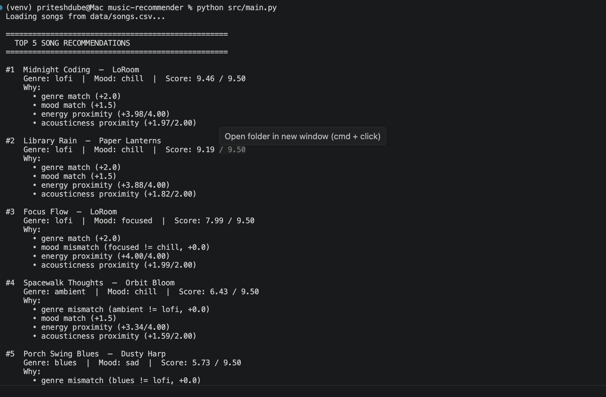

# Music Recommender System

A music recommendation engine with two interfaces: a deterministic scoring-based CLI recommender and an AI-powered playlist planner built with Google Gemini.

---

## Project Summary

This system recommends songs from a curated catalog by matching them against a user's taste profile. It supports two modes:

- **CLI Recommender** — a pure Python scoring engine that ranks songs using weighted feature matching (genre, mood, energy, acousticness)
- **AI Playlist Planner** — a Streamlit web app backed by a Gemini agent that takes a natural language description of your current vibe and returns a personalized playlist with explanations

---

## How The System Works

### Song Features

Each song in `data/songs.csv` has:

| Feature | Type | Description |
|---|---|---|
| `genre` | Categorical | e.g. lofi, rock, pop, jazz |
| `mood` | Categorical | e.g. chill, energetic, intense |
| `energy` | Numerical (0–1) | How high-energy the track feels |
| `valence` | Numerical (0–1) | Musical positivity |
| `danceability` | Numerical (0–1) | Suitability for dancing |
| `acousticness` | Numerical (0–1) | Acoustic vs. electronic character |
| `tempo_bpm` | Numerical | Beats per minute |

### User Profile

A `UserProfile` captures:

- `favorite_genre` and `favorite_mood` — categorical taste anchors
- `target_energy` — preferred energy level
- `likes_acoustic` — acoustic vs. electronic preference

### Scoring Algorithm

Each song is scored against the user profile using a Gaussian proximity function. The score peaks when a song's numerical features are close to the user's target values and drops off as distance increases.

```
Score = genre_match_bonus
      + mood_match_bonus
      + gaussian(energy, target_energy, σ=0.20) × weight
      + gaussian(acousticness, target_acoustic, σ=0.25) × weight
```

| Component | Max Points |
|---|---|
| Genre match | +2.0 |
| Mood match | +1.5 |
| Energy proximity (Gaussian) | 0–4.0 |
| Acousticness proximity (Gaussian) | 0–2.0 |
| **Max total score** | **~9.5** |

All songs are scored, sorted descending, and the top `k` are returned.

### AI Playlist Planner

The Gemini-powered agent uses a tool-use agentic loop:

1. User describes their situation in natural language (e.g. "late night studying, need calm focus music")
2. Gemini reasons through the description to infer genre, mood, and energy preferences
3. It calls tools (`get_catalog_summary`, `get_recommendations`, `filter_songs_by_attribute`, `get_song_details`) to query the song catalog
4. It returns a curated playlist with explanations for each pick

The loop runs up to 10 turns as a safety cap against runaway API calls.

---

## Project Structure

```
applied-ai-sytem-final/
├── data/
│   └── songs.csv              # Song catalog (20 songs)
├── src/
│   ├── main.py                # CLI entry point
│   └── recommender.py         # Core scoring engine (Song, UserProfile, Recommender)
├── ai_agent/
│   ├── agent.py               # Gemini agentic loop (plan_playlist)
│   ├── tools.py               # Tool implementations for Gemini function calling
│   └── app.py                 # Streamlit web UI
├── tests/
│   └── test_recommender.py    # Unit tests (40+ cases)
├── .env                       # API keys (not committed)
├── requirements.txt           # Python dependencies
├── model_card.md              # Model card
└── README.md
```

---

## Setup and Installation

### Prerequisites

- Python 3.11+
- A [Google Gemini API key](https://aistudio.google.com/app/apikey)

### 1. Clone the repository

```bash
git clone <repo-url>
cd applied-ai-sytem-final
```

### 2. Create and activate a virtual environment

```bash
python -m venv venv

# macOS / Linux
source venv/bin/activate

# Windows
venv\Scripts\activate
```

### 3. Install dependencies

```bash
pip install -r requirements.txt
```

### 4. Configure environment variables

Create a `.env` file in the project root:

```bash
touch .env
```

Add your Gemini API key:

```
GEMINI_API_KEY=your_api_key_here
```

The key is required only for the AI Playlist Planner. The CLI recommender works without it.

---

## Running the Project

### CLI Recommender

Runs the scoring engine against three pre-built user profiles (Chill Lofi, High-Energy Pop, Deep Intense Rock) and prints the top 5 recommendations for each.

```bash
python -m src.main
```

Expected output:

```
=== Recommendations for Chill Lofi User ===
1. Midnight Rain (lofi) — score: 8.92
   Reasons: genre match, mood match, energy close to target
...
```

### AI Playlist Planner (Streamlit Web App)

Launches the interactive web interface where you describe your vibe in plain language and the Gemini agent builds a playlist for you.

```bash
streamlit run ai_agent/app.py
```

Then open [http://localhost:8501](http://localhost:8501) in your browser.

The sidebar shows the full song catalog. Enter a description like:

> "Sunday morning, making coffee, want something calm and acoustic"

The agent will reason through your input and return a playlist with song-by-song explanations.

### Running Tests

```bash
pytest
```

Tests cover Gaussian scoring, full song scoring, recommender ranking, edge cases (empty catalog, out-of-range values), explanation generation, and determinism.

---

## Tech Stack

| Layer | Technology |
|---|---|
| Language | Python 3.11 |
| Web UI | Streamlit |
| AI Model | Google Gemini 2.0 Flash (`gemini-2.0-flash-exp`) |
| AI SDK | `google-genai` |
| Data handling | pandas |
| Env management | python-dotenv |
| Testing | pytest |

---

## Limitations and Potential Biases

- The catalog contains only 20 songs — results are constrained by what's available
- Genre and mood bonuses are fixed weights; users who prioritize an artist over genre/mood are not well represented
- The Gaussian scoring assumes a symmetric preference curve — it treats "a little too high energy" the same as "a little too low energy"
- The system does not learn or update from user feedback
- The AI agent is limited to the 20-song catalog and cannot search external music databases

---

## Screenshots

CLI output:


